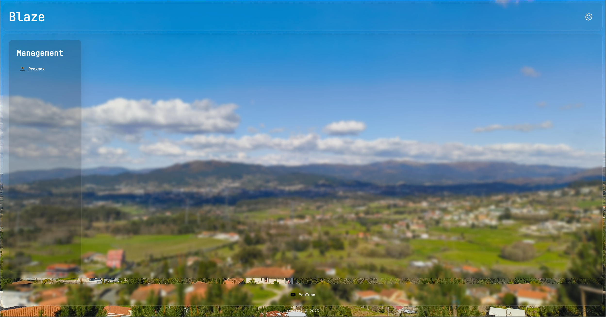
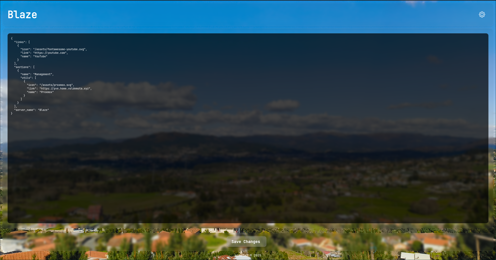

# Dashing

A lightweight, self-hosted dashboard built with Rust and HTMX, designed for simplicity and speed.




## Core Concepts

The goal of Dashing is to provide a fast and resource-efficient dashboard without the overhead of modern frontend frameworks. Simplicity is the key, and this is achieved with Rust for the backend and HTMX for the frontend, which results in a simple and fast application.

This approach also minimizes client-side JavaScript, resulting in a tiny payload and a snappy user experience.

## Features

* **Link Management:** A central place to organize and quickly access your most-used links.
* **Live Editing:** The configuration can be edited directly from the frontend, with server-side validation.
* **Server-Rendered UI:** All interactions are handled on the server, keeping the client lightweight.
* **Minimalist Stack:** Built on a robust and memory-safe Rust backend for reliability.
* **Self-Hosted:** Full control over your data and deployment.

## Tech Stack

* **Backend:** Rust
    * **Web Framework:** [axum](https://github.com/tokio-rs/axum)
    * **Templating:** [minijinja](https://docs.rs/minijinja/latest/minijinja/)
    * **Serialization:** [serde](https://serde.rs/)
* **Frontend:** [HTMX](https://htmx.org/)
* **Data Persistence:** A single `config.json` file serves as the data source.

## Getting Started

### Prerequisites

* Rust toolchain (latest stable recommended)
* Git

### Installation & Running

1.  **Clone the repository:**
    ```sh
    git clone https://github.com/acmota2/dashing.git
    cd dashing
    ```

2.  **Build the application:**
    ```sh
    cargo build --release
    ```

3.  **Run the binary:**
    ```sh
    ./target/release/dashing
    ```

By default, the application should now be accessible at `http://localhost:8080`.

### Development with Nix

For a reproducible development environment, you can use the provided `flake.nix` file. This is especially useful for tools like `bacon` (for live reloading) when using NixOS.

1.  **Enter the development shell:**
    ```sh
    nix develop
    ```
    **Optionally, you can also preserve your shell**:
    ```sh
    nix develop -c $SHELL
    ```

2.  **Run with live reloading:**
    ```sh
    bacon run
    ```

This will watch your project for changes and automatically recompile and restart the server.

## Roadmap

This project is in its early stages. Future planned enhancements include:

* [ ] **Dashboard Widgets:** Integrate configurable widgets for displaying real-time information (e.g., system stats, weather, API data).
* [ ] **Reactive Theming:** Introduce themes (e.g. color picking based on a possibe to change background) that adapt based on the user's background image.
* [ ] **Enhanced Interactivity:** Explore using `_hyperscript` for minor client-side enhancements where necessary.

## License

This project is licensed under the GNU General Public License v3.0.
