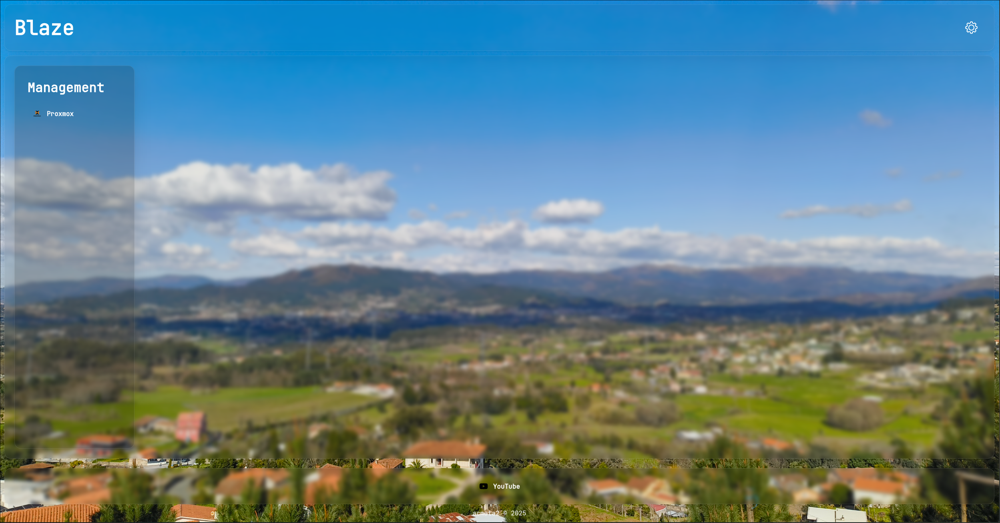
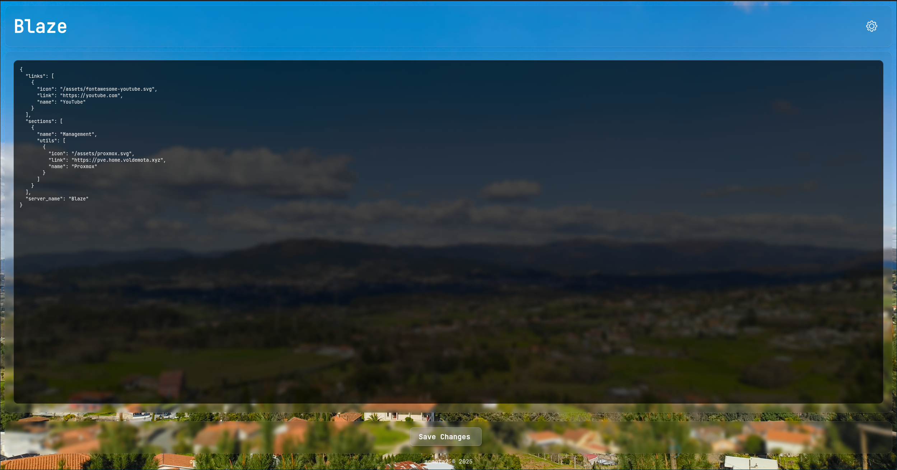

# Dashing

Dashing is a lightweight, self-hosted dashboard for organizing general links and home server pages.
It is designed to be fast, resource-efficient, and easy to run as a single container.

The application uses a server-rendered UI built with Rust and HTMX so interactions are responsive and simple.

## Features

- Link and utility organization
- Live configuration editing with server-side validation
- Server-rendered UI using HTMX
- Single-file JSON configuration
- Self-hosted using containers

## Runtime configuration

Dashing is configured via environment variables and a JSON configuration file.
When running in a container, the following environment variables are recognized:

- **`CONFIG_PATH`** 
  Path to the configuration file.  
  Default: `/etc/dashing/config.json`

- **`ASSETS_PATH`**  
  Path to the static assets directory served by the application.  
  Default: `/assets`

These defaults are suitable for containerized usage. Both paths can be overridden if needed.

## Tech stack

- **Backend:** Rust
    - Web framework: [axum](https://github.com/tokio-rs/axum)
    - Templating: [minijinja](https://docs.rs/minijinja/latest/minijinja/)
    - Serialization: [serde](https://serde.rs/)
- **Frontend:** [HTMX](https://htmx.org/)
    - Any client-side enhancements are expected to be incremental and lightweight, `_hyperscript` being the preferred option
- **Configuration:** JSON
- **Distribution:** OCI container (Docker / Podman compatible)

## Project status

Dashing implements the intended application end-to-end and reflects the overall structure and behavior of the final design.

The current state prioritizes validating the application’s flow and interaction model over comprehensive error handling and operational robustness. The intended user experience is reasonably shown in the current frontend. Parts of the backend still favor direct failure over user-facing feedback.

Certain classes of errors might abruptly shutdown the application.

---

## Future plans

- Improved configuration validation and feedback
- Optional dashboard widgets (system information, external API data, etc.)
- Minor UI and theming refinements

---

## Contributors

- **@acmota2** — original author and maintainer

Additional contributors may be listed here as the project evolves.

---

## License

This project is licensed under the GNU General Public License v3.0.

